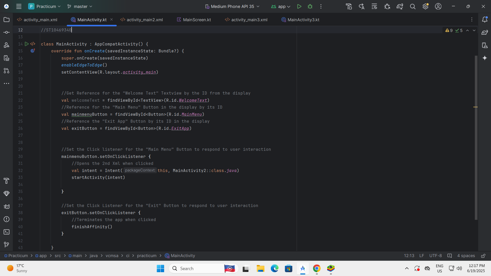

# Practicum Exam IMAD5112- Nikyle Mazeau

## A fully functional Android Kotlin studio project written to assist you in managing your favourite music!

This project is a Music playlist managing app that will allow you to easily manage your favourite music and songs. It can be challenging to manage a large amount of music and songs because we all know music can be addicting, this makes that process a walk in the park and it helps achieve the following:

* Helps manage your playlists and songs in a neat and orderly fashion.
* Add as many songs as you want to your playlists as there is no limit!

## Screenshots/Images of the app running

Below are some screenshots of the app running on the emulator if you are still confused or unsure  
 
This Screenshot shows the source code directly from android studio on how the next button on the welcome screen was coded.

  

